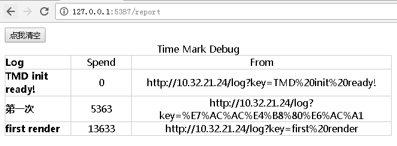

#Time Mark Debug#

这是通过js端函数埋点，然后在服务端统一查看js执行性能的在线report，使用场景主要是有多个异步环境，存在并发的js操作，而js无法但不调试的情况下，分析js性能瓶颈

##优点##
* 按照时间先后顺序，自动计算间隔花费时间
* 调试report可以自己修改，html格式，支持js语法的模板

##主要使用场景##
* Hybrid调试，各种有异步js场景的调试以及性能分析，定位并且找出消耗消耗的大头
* 微信小程序/支付宝小程序/各种小程序

##使用方法##
把inject.js加到要使用的文件里面，url改掉
找一个server（比如本机），一个node进程（server端启动node index.js）

例子
TMD('页面开始')

在server端
http://xx.xx.xx.xx/clean
清除日志

http://xx.xx.xx.xx/report
看调试报告

http://xx.xx.xx.xx/log?key=xxx
发送日志，key可以不填

##效果##
